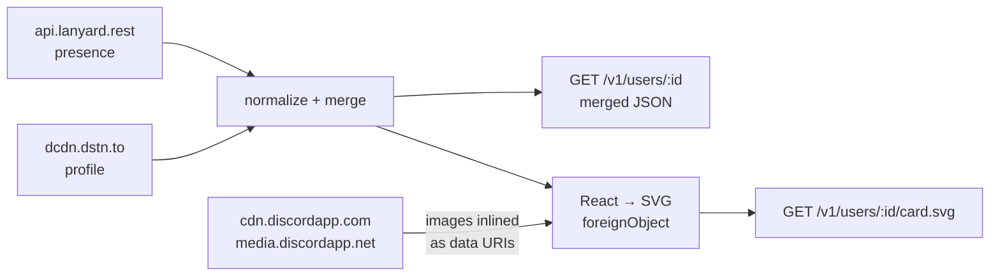

<div align="center">

# discord-presence-api

**One merged Discord profile API — presence from Lanyard, profile from dcdn — rendered as an SVG card for your README.**


<a href="LICENSE"></a>

[Examples](#customization-examples) · [Requirements](#requirements) · [Quick start](#quick-start) · [Embedding](#embedding-a-card) · [Parameters](#card-parameters) · [Configuration](#configuration) · [Security](#security) · [License](#license)

<br>


<sub>Both images are live renders from a running instance — status, activity and progress update on their own.</sub>

</div>

## Why

Discord profile data is split across two incomplete sources:

| | Lanyard | dcdn.dstn.to |
|---|---|---|
| Status, platforms, activities, custom status | ✅ | ❌ |
| Banner, bio, pronouns, connected accounts | ❌ | ✅ |
| Nameplate, clan tag, display-name styles | ✅ | ✅ |

This service merges both into one normalized payload and renders it as an SVG card. Neither upstream needs a token, so the container holds no secrets.

It also fixes a gap that existing renderers share: activities are kept **generic**. Filtering to `type === 0` plus a Spotify special case — the common approach — silently drops `type: 2` (listening) activities from custom apps, which is exactly what a self-built music presence sends.

What the merge makes possible beyond a Lanyard-only renderer:

- **Real profile badges**, including Nitro tenure and server boosting. Renderers built on Lanyard alone cannot show these; dcdn carries the badge icon hashes, so no local badge table is needed either.
- **Collectible nameplates**, drawn from the plate artwork itself. The `collectibles-products` record does expose `background_colors`, but those are the shop listing's colors — for "Koi Pond" violet and pink, while the plate is a teal pond. The endpoint is only used for the collectible's name.
- **Nitro display-name styling**: `display_name_styles` colors and effects (solid, gradient, neon, toon, pop, glow).
- **The profile gradient** as an optional card background.
- **Banner, bio, pronouns and connected accounts** for layouts that want them.
- **Lanyard KV** passed through in `meta.kv`.

## Customization examples

<details>
<summary><strong>Compare common card options</strong></summary>

Most previews use the standard `card` layout. Parameters can be combined freely.

| Option | Variant A | Variant B |
|---|---|---|
| **Layout** | <br>`layout=card` | <br>`layout=wide` |
| **Theme** | <br>`theme=dark` | <br>`theme=light` |
| **Profile gradient** | <br>`profileGradient=true` | <br>`profileGradient=false` |
| **Badges** | <br>`hideBadges=false` | <br>`hideBadges=true` |
| **Username** | <br>`showUsername=true` | <br>`showUsername=false` |
| **Nameplate** | <br>`hideNameplate=false` | <br>`hideNameplate=true` |

</details>

## Requirements

Presence comes from Lanyard, and Lanyard is a Discord bot — it can only see the presence of users it shares a server with. Two things have to be true before a card shows anything:

1. **Join the [Lanyard Discord](https://discord.gg/UrXF2cfJ7F).** No further setup, no bot to authorize: once you are in that server, `api.lanyard.rest/v1/users/<your-id>` starts answering. Leaving the server stops it again.
2. **Let Discord share your activities.** In **User Settings → Activity Privacy**, *Share your detected activities with others* has to be on, or every card renders as idle. For Spotify specifically, **Settings → Connections → Spotify → Display Spotify as your status** has to be on too.

Also worth knowing:

- An **Invisible** online status is reported by Lanyard as `offline`, and the card draws it that way.
- The profile half (banner, bio, pronouns, connected accounts, badges) comes from dcdn.dstn.to and needs none of the above — it reads the public profile. Connected accounts only appear if they are set to visible on your Discord profile.
- Set `ENABLE_DCDN=false` to run presence-only and never touch that third party.

### Privacy

A card in a public README is public. Anyone who opens the page sees whatever your presence currently says — the game you are in, Rich Presence details some games put there (session, party, occasionally a file name), your custom status, and with `showConnections` or the `banner` layout, your connected accounts and bio.

The card is built so you can cut any of that:

| Want to hide | Use |
|---|---|
| A specific app's activity | `ignoreAppId=<application id>` |
| All activity | `hideActivity=true`, or `whenNotUsed` to only show the idle line |
| What a game reports in detail | `hideTimestamp=true` plus `maxActivities=1` |
| Custom status text | `hideStatus=true` |
| Online/offline dot, platform, badges, tag | `hidePresence` / `hidePlatform` / `hideBadges` / `hideTag` |
| Bio, pronouns, connections | they are off by default — `showPronouns` and `showConnections` opt in |

Set the ones you always want with [`DEFAULT_PARAMS`](#configuration) so the instance enforces them regardless of what a URL asks for — and remember `ALLOWED_USER_IDS` means your instance renders nobody but you.

One thing no parameter controls: GitHub proxies README images through camo and caches them, so a card that was public for a minute may stay visible for longer than the presence behind it.

The view counter stores nothing but a number per user id — no addresses, no agents, no timestamps. It could not store more if it wanted to: camo replaces the client entirely.

## How it works



Every outbound request goes through a single egress point with a four-host allowlist. Activity assets are never fetched from the URL Discord embeds in the presence — see [Security](#security).

## Quick start

```bash
cp .env.example .env     # set ALLOWED_USER_IDS to your snowflake
docker compose up -d
curl localhost:9242/healthz
```

The shipped [`compose.yaml`](compose.yaml) pulls the published image and publishes
port `8080` as `HOST_PORT` (default `9242`), hardened: non-root, read-only root
filesystem, all capabilities dropped, 256 MB. To build from a checkout instead,
replace the `image:` line with `build: .`.

```yaml
services:
  discord-presence-api:
    image: ghcr.io/nichtlegacy/discord-presence-api:latest
    restart: unless-stopped
    ports:
      - "${HOST_PORT:-9242}:8080"
    environment:
      ALLOWED_USER_IDS: "400672307833733121"
      DEFAULT_PARAMS: "hideStatus=true&hideTag=true"
      TRUST_PROXY: "true"
    read_only: true
    tmpfs:
      # ffmpeg needs scratch space for animated collectibles.
      - /tmp:size=64m
    cap_drop: [ALL]
    security_opt: ["no-new-privileges:true"]
    mem_limit: 256m
```

`ALLOWED_USER_IDS` is mandatory. An empty value answers `403` to everything rather than rendering cards for arbitrary accounts.

If the card renders but always looks idle or offline, the cause is almost always [Requirements](#requirements) rather than this service.

Local development:

```bash
npm install
npm test
ALLOWED_USER_IDS=<your-id> npm run dev
```

## Embedding a card

```md

```

Three layouts, picked with `layout`:

| Layout | Size | Shape |
|---|---|---|
| `card` | 400×218 | identity on top, activity below — the familiar widget |
| `wide` | 700×88 | one row, fits under a README heading |
| `banner` | 500×320 | profile banner, nameplate, bio, activity |

For a card that follows the reader's GitHub theme, request both and let the browser choose:

```html
<picture>
  <source media="(prefers-color-scheme: dark)" srcset="https://discord-presence.nichtlegacy.com/v1/users/400672307833733121/card.svg?theme=dark" />
  
</picture>
```

### Parity with cnrad

Parameter names follow [cnrad/lanyard-profile-readme](https://github.com/cnrad/lanyard-profile-readme), so an existing embed only needs its host swapped:

```md
<!-- before -->


<!-- after -->

```

`hideClan` is accepted as an alias for `hideTag`, `hideElapsed` for `hideTimestamp`, and `radius` for `borderRadius`. `hideDiscrim` is dropped — discriminators no longer exist. `optimized` is replaced by `animated=false`, which is what it actually controlled.

## Card parameters

<details>
<summary><strong>Appearance</strong></summary>

| Parameter | Values | Default |
|---|---|---|
| `layout` | `card` (400×218), `wide` (700×88), `banner` (500×320) | `card` |
| `theme` | `dark`, `light` | `dark` |
| `bg` | hex without `#` | theme background |
| `accent` | hex without `#` | profile accent color |
| `borderRadius` | `0`–`40`, CSS units tolerated (`10px`) | `12` |
| `clanBackgroundColor` | hex without `#` | card surface |
| `profileGradient` | `true`, `false` — paint the card in the Nitro profile gradient | `true` |

</details>

<details>
<summary><strong>Identity</strong></summary>

| Parameter | Values | Default |
|---|---|---|
| `showDisplayName` | `true`, `false` | `true` |
| `showUsername` | `true`, `false` — the plain handle below the display name; ignored when `showDisplayName=false`, where the handle already is the name | `true` |
| `hideProfile` | `true`, `false` — activity only | `false` |
| `hideStatus` | `true`, `false` — custom status text | `false` |
| `hidePresence` | `true`, `false` — the status dot on the avatar | `false` |
| `hideTag` | `true`, `false` — server (clan) tag | `false` |
| `hideBadges` / `maxBadges` | `true`/`false`, `0`–`12` | `false` / `6` |
| `hideDecoration` | `true`, `false` | `false` |
| `hideNameplate` | `true`, `false` — collectible nameplate behind the name | `false` |
| `hidePlatform` | `true`, `false` — desktop/mobile/web glyphs | `false` |
| `hideBanner` | `true`, `false` — `banner` layout only | `false` |
| `showPronouns` | `true`, `false` — off, they crowd the handle line | `false` |
| `showConnections` | `true`, `false` — connected accounts as brand marks | `false` |
| `nameStyles` | `true`, `false` — Nitro display-name colors and effects | `true` |
| `nameFont` | `true`, `false` — embed the Nitro typeface (8–26 KB) | `true` |
| `animated` | `true`, `false` — animated avatar | `true` |
| `animatedDecoration` | `true`, `false` | `false` |
| `animatedBanner` | `true`, `false` | `false` |
| `animatedNameplate` | `true`, `false` — transcodes the collectible's animation | `true` |

</details>

<details>
<summary><strong>Activity</strong></summary>

| Parameter | Values | Default |
|---|---|---|
| `hideActivity` | `true`, `false`, `whenNotUsed` | `false` |
| `hideTimestamp` | `true`, `false` — elapsed time and progress | `false` |
| `hideSpotify` / `hideAppleMusic` | `true`, `false` | `false` |
| `ignoreAppId` | comma-separated application IDs | — |
| `maxActivities` | `1`–`3` — stack more than the leading activity | `1` |
| `idleMessage` | text, max 64 chars | `I'm not currently doing anything!` |

</details>

Unknown or malformed values fall back to the default — they are never passed through into the document.

### Behavior notes

**Progress and timing.** An activity that reports both `timestamps.start` and `end` — Spotify, Apple Music, some games — is drawn with a progress bar and `position / length`. Open-ended activities such as a radio stream only carry a start, so they fall back to elapsed time. `hideTimestamp` removes both.

**Connected accounts.** Brand marks are generated from the official [simple-icons](https://simpleicons.org) package into [`src/render/brands.ts`](src/render/brands.ts) (`npm run brands`) and inlined, so rendering never reaches an icon host. Xbox and Skype have no simple-icons entry any more and are skipped rather than approximated.

**Nitro typefaces.** Discord styles display names with Google Fonts and reports the choice as `font_id`. A webfont cannot be linked from an SVG behind GitHub's image proxy, so the file is inlined as a data URI like every other asset — 8–26 KB depending on the family. The fonts live in `assets/fonts/` under the SIL Open Font License 1.1 (see `assets/fonts/LICENSES.md`), refreshed with `npm run fonts`. `nameFont=false` keeps the colours and effect but drops the file. Only `font_id` 12 is confirmed against Discord's markup; the rest follow the mapping the Glance widget uses, and an unknown id simply keeps the card font.

**Animated collectibles.** Discord ships animated nameplates as `.webm` with an alpha channel, and a video never plays inside an SVG. An animated raster does, though — including in the static image context a README embed uses. So the video is transcoded to animated WebP once and inlined: at the size the plate is drawn that costs about 14 KB over the static render, against roughly 70 KB for the same frames as GIF. On by default, because the plate is the one part of the card meant to move and the transcode is cached for a day; `animatedNameplate=false` turns it off. Two details the obvious transcode gets wrong: the native VP9 decoder drops the alpha channel (hence `-c:v libvpx-vp9`), and animated WebP cannot store per-frame alpha at all — so the artwork is composited onto the card colour instead, which is why the transcode is cached per background. APNG would keep the alpha but costs ~237 KB against ~16 KB. This needs `ffmpeg`, which the container image installs — without it the card logs a warning once and falls back to the static plate.

**Payload size.** Every image is inlined, so animation is the dominant cost:

| Variant | Size |
|---|---|
| `layout=card` | ~117 KB |
| `layout=card&animated=false` | ~62 KB |
| `layout=banner` | ~123 KB |
| `layout=banner&animatedBanner=true` | ~863 KB |
| `animatedNameplate=true` | +14 KB over the static plate |

That is why animated banners and decorations stay opt-in, while the avatar and
the nameplate follow what Discord itself shows.

## Profile views

Off by default (`ENABLE_VIEWS=true`). It is the only part of the service that writes
anything, and it needs a writable `/data` — compose mounts a named volume for it and the
rest of the container stays read-only.

```md

```

Shaped like a [shieldcn](https://shieldcn.dev) badge, measured off their output rather than
guessed: 32px tall, 6px corners, 12px padding, a 16px logo, 14px text, one solid fill and no
border. It sits in a row with them without a seam.

| Parameter | Values | Default |
|---|---|---|
| `label` | text, max 32 chars | `Profile Views` |
| `color` | hex without `#` — the fill | `5865f2` (Discord blurple) |
| `textColor` | hex without `#` | `ffffff` |
| `borderRadius` | `0`–`16` | `6` |

```md
[](https://github.com/nichtlegacy/discord-presence-api)
```

Nothing in this route reaches an upstream, so it answers as long as the container does. When
it does not — container down, proxy down, `ENABLE_VIEWS=false` — the embed falls back to its
alt text, which is why the snippet above spells one out.

### What the number means

It counts image fetches, not people. GitHub proxies README images through camo, which
replaces the client — there is no address, agent or user left to deduplicate by, so
crawlers and your own reloads count like anyone else. Every README counter works this way;
[komarev's](https://github.com/antonkomarev/github-profile-views-counter) documentation says
the same thing about its own numbers.

The one thing that has to be right is the cache header. Camo caches per URL, so anything
cacheable would freeze the count at whatever the first fetch saw. `views.svg` answers with
`max-age=0, no-cache, no-store, must-revalidate` and no `ETag` — the recipe komarev uses.

That header is also why the counter stays its own route and never moves into the card: the
card is cached for `PRESENCE_TTL` seconds, so it could only ever register one hit per
minute, and making it uncacheable would put every README reader straight through to Lanyard.

## Endpoints

```
GET /healthz
GET /v1/users/:id             → merged JSON
GET /v1/users/:id/card.svg    → rendered card
GET /v1/users/:id/views.svg   → view counter badge (ENABLE_VIEWS=true)
```

Only `card.svg` and `views.svg` need to be public. The JSON carries bio, pronouns and connected
accounts, so keep `/v1/users/:id` on the internal network and let your own
clients (dashboards, Glance widgets) reach the published port directly.

<details>
<summary><strong>Caddy reverse proxy</strong></summary>

A reverse proxy can enforce that:

```caddy
discord-presence.example.com {
    @public path_regexp ^/v1/users/[0-9]{17,20}/(card|views)\.svg$
    handle @public {
        reverse_proxy 10.0.0.2:9242 {
            # Overwrite rather than append: Caddy adds to an existing header,
            # so a client could otherwise hand in any address and walk around
            # the rate limit. Behind Cloudflare use {http.request.header.Cf-Connecting-Ip}.
            header_up X-Forwarded-For {remote_host}
        }
    }
    handle /healthz {
        reverse_proxy 10.0.0.2:9242
    }
    handle {
        respond "Not Found" 404
    }
}
```

`TRUST_PROXY=true` only makes sense with a proxy that overwrites the header like
this. Without it, leave the variable at `false`.

</details>

## Configuration

All configuration is environment variables, read once at startup so a broken deployment fails immediately instead of on the first request. See [`.env.example`](.env.example).

| Variable | Default | Purpose |
|---|---|---|
| `ALLOWED_USER_IDS` | — | **Required.** Comma-separated snowflakes this instance will serve |
| `DEFAULT_PARAMS` | — | Card defaults for the whole instance, as a query string |
| `ENABLE_DCDN` | `true` | Set `false` to skip dcdn (banner, bio, pronouns, connections) |
| `ENABLE_VIEWS` | `false` | Turn on the view counter. Needs a writable `/data` — compose mounts a volume |
| `VIEWS_FILE` | `/data/views.json` | Where counts are stored |
| `VIEWS_FLUSH_MS` | `10000` | How often counts reach the disk; a hard kill loses at most this much |
| `PRESENCE_TTL` / `PROFILE_TTL` / `IMAGE_TTL` | `60` / `300` / `3600` | Cache lifetimes in seconds |
| `FETCH_TIMEOUT_MS` / `MAX_FETCH_BYTES` | `5000` / `2000000` | Upstream timeout and response cap |
| `RATE_LIMIT` / `RATE_WINDOW_MS` | `60` / `60000` | Requests per IP per window |
| `TRUST_PROXY` | `false` | Enable only when a trusted proxy **overwrites** `X-Forwarded-For` |
| `PORT` | `8080` | Listen port inside the container |
| `HOST_PORT` | `9242` | Published port on the host (compose only) |

`DEFAULT_PARAMS` presets card parameters instance-wide:

```env
DEFAULT_PARAMS=hideStatus=true&hideTag=true&hideBadges=true
```

A README embed then needs only the bare URL, and the look changes without touching the README. Request parameters still win over the defaults.

## Security

The service is internet-facing and fetches remote images, so the guards matter more than the features.

**Activity assets never reach an attacker-chosen host.** Discord delivers them as `mp:external/<hash>/https/<host>/<path>`. Rewriting that back to the origin URL — what cnrad's renderer does — turns any Rich Presence into an SSRF primitive: whoever sets the presence decides which address the container calls, internal ranges included. Instead, assets are routed through `media.discordapp.net`, Discord's own mirror, which serves the same image and resizes it on the way.

Everything else follows from that:

- **Host allowlist** — outbound requests are limited to four hosts, https only, redirects refused. [`src/lib/http.ts`](src/lib/http.ts) is the single egress point.
- **User allowlist** — `ALLOWED_USER_IDS` is mandatory, and empty means serve nothing.
- **Parameter validation** — colors must match a hex pattern, choices must be members of a known set, free text is capped and stripped. Unchecked values would otherwise land in a CSS declaration.
- **Upstream text is sanitized** — song titles, bios and status text are length-capped with control characters removed before React escapes them.
- **Limits** — 5 s timeout and a 2 MB cap per upstream response, read streamed so an oversized body never accumulates in memory; 60 requests per IP per minute.
- **Container** — non-root, read-only rootfs, all capabilities dropped, `no-new-privileges`, 256 MB memory cap.

Known ceiling: the host allowlist has no DNS pinning, so a rebinding attack would need control over one of four Discord/Lanyard domains. Resolve-then-connect is the upgrade path if that assumption stops holding.

## Project structure

```text
discord-presence-api/
├── src/index.ts        # the three routes, rate limit, security headers
├── src/config.ts       # env parsing and the outbound host allowlist
├── src/lib/            # lanyard, dcdn, normalize, http egress, cache, assets, animate, views
├── src/render/         # card.tsx (React → SVG), badge.tsx, params, image inlining, brand marks
├── scripts/            # generate-brands.mjs, run via `npm run brands`
├── tests/              # normalize, render and security checks
└── compose.yaml        # hardened deployment, proxy network, no published port
```

## Development

```bash
npm test          # node --test, builds first
npm run typecheck
npm run brands    # regenerate src/render/brands.ts from simple-icons
```

CI runs the tests, the typecheck, a Docker build check, and verifies that the committed brand marks still match what `npm run brands` produces — a dependency bump that changes an icon path must not land silently.

## Notes

- Images are inlined as data URIs because GitHub's camo proxy fetches the SVG but nothing the SVG references.
- Presence is cached 60 s, profile 300 s, images 1 h. GitHub's proxy caching means a card is never truly live regardless.
- dcdn.dstn.to is a third-party mirror. If it fails, the card degrades to presence-only instead of erroring.

## Credits

Data from [Lanyard](https://github.com/Phineas/lanyard) and [dcdn.dstn.to](https://dcdn.dstn.to). The `<svg><foreignObject>` rendering approach and the card layout vocabulary are borrowed from [cnrad/lanyard-profile-readme](https://github.com/cnrad/lanyard-profile-readme), which was used as a design reference.

Unofficial project, not affiliated with or endorsed by Discord.

## License

[MIT](LICENSE)
